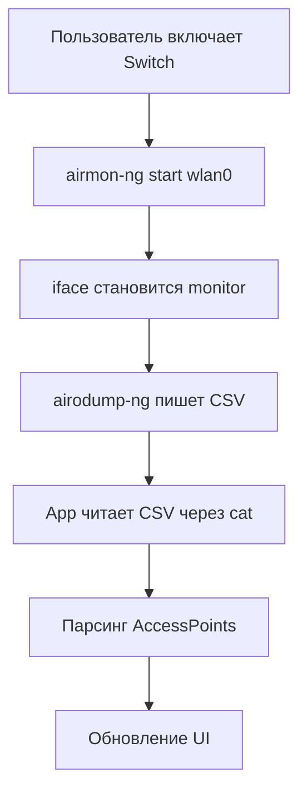

# 🛰️ Houne Airodump Android (NetHunter Integration)

Приложение **Houne Airodump** позволяет запускать и управлять утилитами `airmon-ng` и `airodump-ng` внутри Kali NetHunter chroot напрямую из Android-интерфейса.  
Работает с root-правами и полностью интегрируется с NetHunter-окружением.

---

## ⚙️ Основные возможности

- Автоматическое обнаружение Kali NetHunter chroot (`/data/local/nhsystem/kali-arm64`)
- Проверка наличия `airodump-ng`
- Переключение интерфейса Wi-Fi в **режим мониторинга**
- Запуск и остановка сканирования `airodump-ng`
- Парсинг CSV-файлов и отображение списка найденных сетей в реальном времени
- Минимальный UI с переключателем и таблицей точек доступа

---

## 🧩 Архитектура

```
MainActivity.kt        — UI и управление кнопками
ScanViewModel.kt       — бизнес-логика и взаимодействие с Shell
RootShell.kt           — запуск команд в chroot
WirelessManager.kt     — анализ интерфейсов и их состояний
ScanService.kt         — фоновое сканирование airodump-ng
AirodumpParser.kt      — парсинг CSV-файлов
ScanDataBus.kt         — Flow-потоки данных между компонентами
```

---

## 🧠 Как это работает

### 1. Подключение к Kali NetHunter chroot

Перед каждой командой приложение готовит окружение:

```bash
mount --bind /proc $CHROOT/proc
mount --bind /sys  $CHROOT/sys
mount --bind /dev  $CHROOT/dev
mount --bind /dev/pts $CHROOT/dev/pts
```

Эти монтирования делают chroot полноценной Linux-средой, где доступны устройства и ядро.  
Также внутрь копируется `mountpoint`, иначе `airmon-ng` не запускается.

Код:

```kotlin
RootShell.runInKaliBash("true")
```

---

### 2. Проверка бинарей

Мы убеждаемся, что Kali и утилиты доступны:

```kotlin
val chrootOk = RootShell.chrootExists()
val dumpOk   = RootShell.binaryExistsInKali("airodump-ng")
```

---

### 3. Включение режима монитора

При активации свитча выполняется:

```bash
airmon-ng start wlan0
```

или при отключении:

```bash
airmon-ng stop wlan0mon
```

После этого приложение определяет, какой интерфейс стал монитором:

```kotlin
val monitor = WirelessManager.getCurrentMonitorIface()
```

---

### 4. Запуск `airodump-ng` внутри Kali

Файлы логов сохраняются во внутреннюю папку `/tmp/airodump_android`, доступную Kali.

```bash
mkdir -p /tmp/airodump_android
airodump-ng   --output-format csv   --write /tmp/airodump_android/current   --write-interval 1 wlan0mon
```

CSV-файл обновляется каждую секунду.

---

### 5. Чтение данных из chroot

Приложение периодически (каждые 2 секунды) читает CSV-файл из Kali:

```kotlin
val csv = RootShell.runInKaliBash(
    "cat /tmp/airodump_android/current-01.csv 2>/dev/null || true"
).output
```

и парсит его:

```kotlin
val aps = AirodumpParser.parseAccessPoints(csv)
ScanDataBus.updateAccessPoints(aps)
```

В итоге UI обновляется в реальном времени.

---

## 💻 Пример вывода в логах

```
airmon-ng start wlan0
[OK] monitor mode enabled on wlan0mon

airodump-ng initial output:
ioctl(SIOCSIWMODE) failed: Device or resource busy
monitor mode vif enabled for [phy0] wlan0mon on [phy0] wlan0mon
```

---

## 🚀 Быстрый старт

1. Установите Kali NetHunter (chroot в `/data/local/nhsystem/kali-arm64`)
2. Убедитесь, что внутри Kali установлены:
   ```bash
   apt install aircrack-ng iw ifconfig
   ```
3. Дайте приложению root-права
4. Подключите Wi-Fi-адаптер, поддерживающий monitor mode
5. Запустите приложение:
   - Выберите интерфейс (`wlan0`, `wlan1`, …)
   - Включите переключатель Monitor Mode
   - Нажмите **Start Scan**

Список сетей появится внизу экрана.

---

## 🧰 Пример кода вызова Shell

```kotlin
val result = RootShell.runInKaliBash("airmon-ng start wlan0")
Log.d("Shell", result.output)
```

```kotlin
val csv = RootShell.runInKaliBash(
    "cat /tmp/airodump_android/current-01.csv || true"
).output
```

---

## 🧾 Типичный цикл работы



---

## 📦 Зависимости

- Android SDK 33+
- Kotlin 1.9+
- Compose Material 3
- Root-доступ
- Kali NetHunter chroot с `aircrack-ng`

---

## 🧑‍💻 Автор

**HouneTeam**  
Проект для интеграции утилит Wi-Fi-аудита NetHunter в удобный Android-интерфейс.
